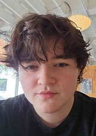
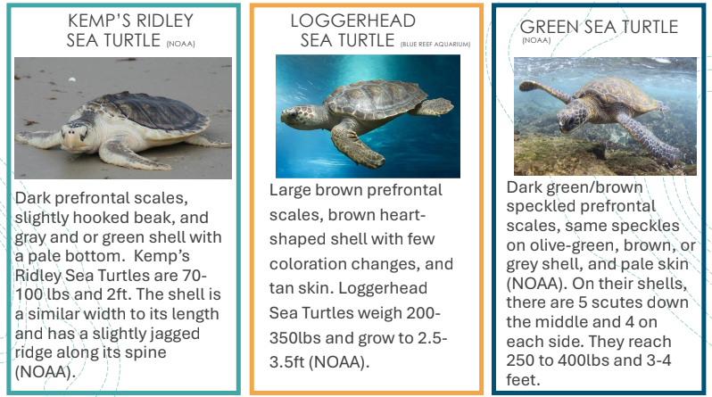
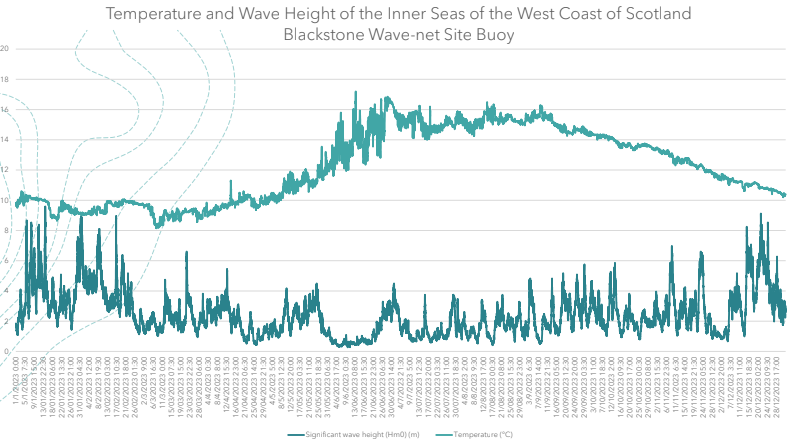
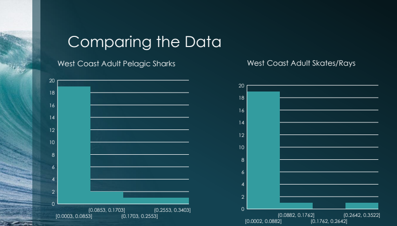
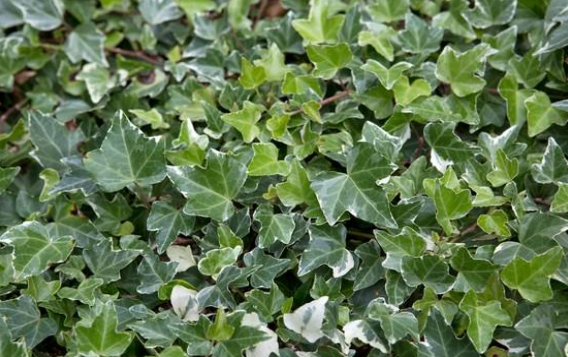
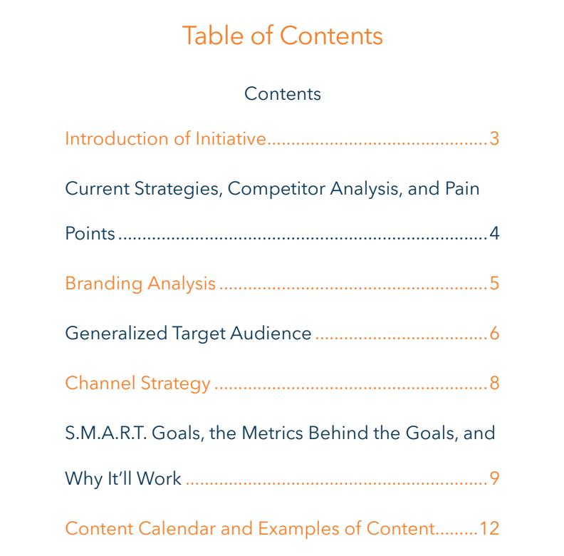
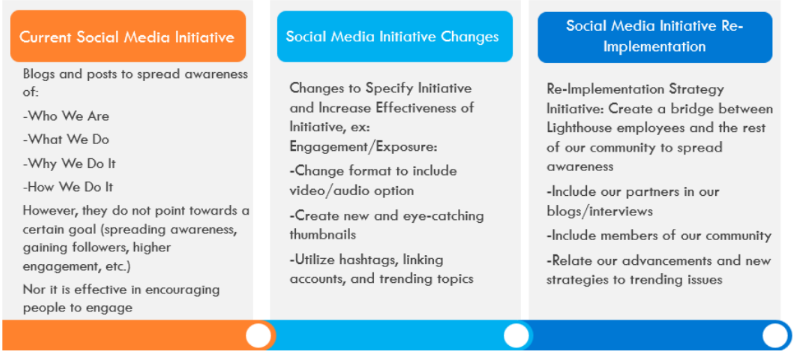
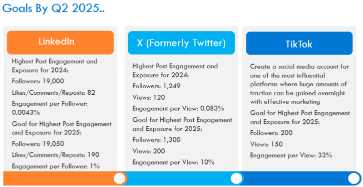

Megumi Ragan
# Summary

Hello! I'm Megumi Ragan, Marine Biology Baccalaureate candidate with extensive animal care experience and training, habitat development and maintenance, and research competencies.
Veteran customer service professional with excellent problem-resolution, presentation, written and verbal skills. Seeking to gain broader hands-on career experience and hone relevant skill portfolio.
Thanks for visiting!
 
## Skills
Leadership | Relationship Management | Data Analysis | Collaboration | Cultural Intelligence | Communications | Animal First Aid | Storytelling | Project Management | Research | Enclosure Development | Sustainability Design | Media Training | Process Improvement | Public Speaking | Sea Turtle Rehabilitation | Aquaculture Development | Animal Taxonomy | SCUBA Certification | Ichthyology | Customer Service | Microsoft Office | Adaptability | Animal Care | Schedule Management |
 
# Marine and Biology Projects:

## Sea Turtle Rehabilitation 

Sea Turtle Rehabilitation Protocol for the Sound of Jura
Developed a sea turtle rehabilitation protocol for the Sound of Jura including: floor plans for a rehabilitation facility, data compilation and analysis, unique identifying traits of species in the area, regional challenges, remediation/triage plans, common illnesses and how to treat them.

https://drive.google.com/file/d/14gyb1K8SXjRLoACUXlXIzieIRvf2WWi6/view?usp=sharing

Sustainability Design, Enclosure Development, Project Management, Research, Ichthyology, Data Analysis, Public Speaking
 
 
## Ecological Impact of Blue Tilapia Sea Pens

 An investigation into the ecological impacts of Blue Tilapia sea pens and which ecosystem they would work best in.

 
 https://drive.google.com/file/d/10G-SQNoskhBuubxuW9sGbFDcoWbdmcW9/view?usp=sharing
  
 Research, Ecosystems, Sustainability Design, Aquaculture Development, Data Analysis, Public Speaking
      
 
## Mean Proportion of Diet Composition by Weight: Skates/Rays Versus Pelagic Sharks
  
Is there a satistically significant composition of diet between pelagics sharks and skates/rays?

 https://drive.google.com/file/d/1gRzSCK2oMy_IYYl3VfRlDAXe16ux05P3/view?usp=sharing

 https://drive.google.com/file/d/1X-g1nSrvupkuW9GqH7NT9Q7m9MEU5XsN/view?usp=sharing

 Research, Statistics, Ecosystems, Sustainability Design, Aquaculture Development, Data Analysis, Public Speaking
 
 
### Human Presence and its Impact on Hedera Helix and the Surrounding Ground Covering Plants of Willow Valley Nature Preserve

How human presence impacts biodiversity of both native and non-native plants.

https://drive.google.com/file/d/1gyl0Iw1uQ_75L--vDyXZOvPtnAyZElaW/view?usp=sharing

Research, Statistics, Ecosystems, Biodiversity, Data Analysis
      
#  Misc Projects: 
    

### Lighthouse Global Branding Report

A comprehensive branding assessment for Lighthouse Global, featuring an analysis of key pain points and strategic recommendations for enhancement across the most impactful platforms.

https://drive.google.com/file/d/1VrnqNdNtx2rDqzM3aM2OVaTMXOHsNn67/view?usp=sharing

Research, Storytelling , Cultural Intellegence, Communications, Marketing, Social Media Presence
    

### Caring For Our Care Providers
 
 The challenges faced by healthcare providers, including financial strain, emotional exhaustion, and mental health issues, require urgent attention and support through improved education access, socialization opportunities, counseling services, and better work-life balance to ensure their well-being and the sustainability of the healthcare system.

 
https://drive.google.com/file/d/1rz71n59G2k9SUBPZKs7jv1pvQcG8ddy-/view?usp=sharing
 
Research, Storytelling, Cultural Intellegence, Communications
 
# Experience 
  
## Pet Care Professional

  Independent, Rover
  
  2018 - Present
  
Delivering exceptional pet sitting and care service with extensive experience in specialized care inclusive of restrictive dietary needs, 
medicine administration, allergy constraints, habitat maintenance, and complex schedule needs. Earned reputation for professionalism, passion, and 
high client satisfaction resulting in long-term portfolio of clients. Clients have included dogs, cats, small mammals, fish, reptiles, and birds.

Relationship Management, Animal First-Aid, Animal Care, Schedule Management, Adaptability, Oral Medication Administration.

  
### Seasonal Pool Attendant

Aquatic Management of Charlotte

2024

In addition to client services and issue resolution, responsible for balancing, testing, 
and recording of chemical levels in pool to ensure safety and compliance standards.

Water Parameter Testing, Water Chemical Balancing, Communications, Customer Service

 ### Hospitality Entry to Supervisor Positions
 
 Various

 2018-2023

Held multiple positions from entry-level server and food prep through to Supervisor, leading teams of 10+.
Experience in customer service, food safety and regulatory control adherence, conflict resolution,
training and onboarding new hires, restaurant operations, process management, scheduling, and financial reporting.

Inventory Management, Leadership, Customer Service, Onboarding & Training, Microsoft Office, Sanitation

### Farm Management Intern

Altari Group

2012-2013

Gained animal care experience inclusive of enclosure safety and maintenance, feeding, hygiene, scheduling and procurement,
vaccination administration, animal first aid, and pasture planning and sustainability. Handling, care, and training of variety of livestock and limited wildlife rehabilitation.

Relationship Management, Animal First-Aid, Animal Care, Schedule Management, Adaptability, Oral Medication Administration, Hoofstock Vaccine Administration

# Education
- Bachelor of Science, Marine Biology & Sustainable Aquaculture | 2021 - Present | Unity Environmental University
- Greenville Technical College | 2021 |	Bachelor of Science
- GED | 2020 | Rowan-Cabarrus Community College

## VOLUNTEERSHIP
•	Human Rights Campaign
•	Ada Jenkins
•	Cornelius Animal Shelter
•	Time Out Youth
•	Central Elementary School

## Linkedin
https://www.linkedin.com/in/megumi-ragan-a67036308/

### Made by Megumi Ragan
  
